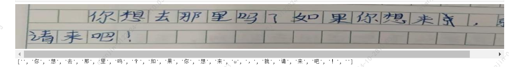

## 代码介绍

   
- 代码旨在完成对于学生作文图片，识别出错字、别字、并根据上下文进行错字的纠正的任务，具体见BLIP文件夹。
- 采用模型: blip-image-captioning-base
- 主要难点：修改扩展英文的 blip模型，训练得到中文blip模型。
- 由于Blip是针对英文训练的，故需要将 blip-image-captioning-base 下的 tokenizer.json 及  vocab.txt 换为本项目中的tokenizer.json 及  vocab.txt，且进行多轮训练更新权重。 


```
python

# train 见脚本： train_blip.ipynb
# predict 见下

import os
from PIL import Image
import torch
from torch.utils.data import DataLoader, Dataset
from transformers import AutoModelForVision2Seq,AutoProcessor
device = torch.device("cuda" if torch.cuda.is_available() else "cpu")

model_id = "Salesforce/blip-image-captioning-base"
processor = AutoProcessor.from_pretrained(model_id)


# Load model and processor
model_path = './caption_result_new/'
model = AutoModelForVision2Seq.from_pretrained(model_path)
model.to(device)


model.eval()

image_path = os.path.join('/root/autodl-tmp/blip/c3data/imgs/1430_0005.jpg')
image = Image.open(image_path).convert('RGB')
image.show()

pixel_values = processor(images=image, return_tensors="pt").pixel_values.to(device)
generated_output = model.generate(pixel_values=pixel_values,max_length=512)

generated_caption = processor.batch_decode(generated_output[0], skip_special_tokens=True)
print(generated_caption)


```



## 背景介绍

   该任务来自于 NLPCC2024 会议中 Task1：Task 1 - Visual Chinese Character Checking（见下说明），Task1的数据集的参考论文为：Towards Real-World Writing Assistance: A Chinese Character Checking Benchmark with Faked and Misspelled Characters。 该任务主要目标是根据学生作文图片，识别出错字、别字、并根据上下文进行错字的纠正。
   
<big>*Task说明*</big>

In the real world where handwriting occupies the vast majority, characters that humans get wrong include faked characters
(i.e., untrue characters created due to writing errors) and misspelled characters (i.e., true characters used incorrectly due to spelling errors), 
as illustrated in Figure 1. Visual Chinese Character Checking task aims at detecting and correcting wrong characters in the given text on an image in real-world scenarios. 
This task focuses on correcting characters based on a human-annotated Visual Chinese Character Checking dataset with faked and misspelled Chinese characters.


  以上参考论文中实现了2种基准方法，这2类基准方法均采用Detection+Correction结构处理处理预测数据。方法1利用文本识别 + 文本生成的方法，而方法2利用文本分割+多模态模型+文本生成的方法。
  
  方法1及方法2的效果都不是很理想。故这里采用多模态的blip模型进行尝试。多模态算法选择方面，由于CLIP是encoder-based model，没有decode过程，不适合用于文本生成的任务，而BLIP模型采用Multimodal mixture of Encoder-Decoder (MED)结构，有decode部分，所以利用blip进行文本生成尝试。